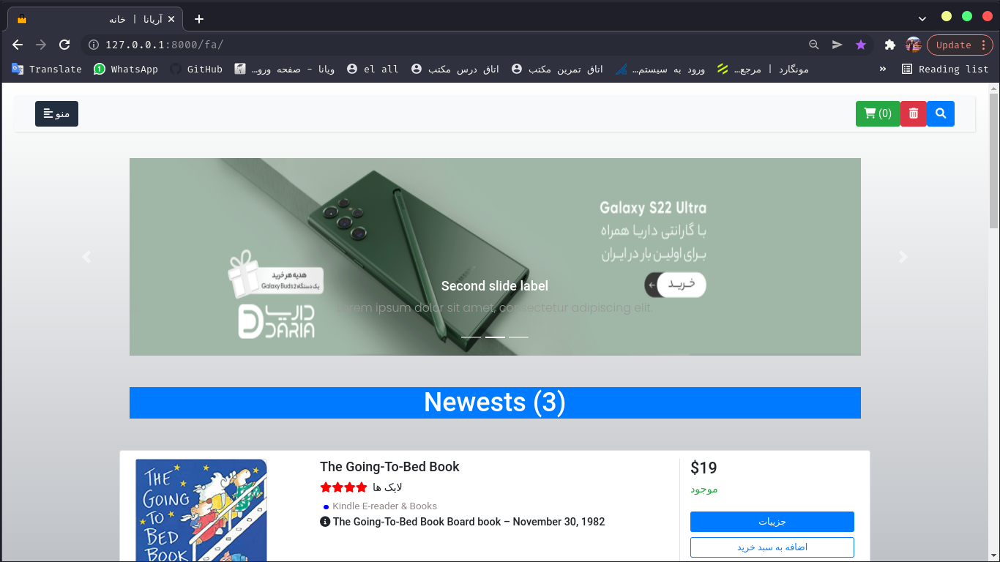

# Ariana Shopping Center

## Powered By Django

### Techs : Python , Django , DRF , Django ORM , SQLite , Docker , DTL , JS , HTML , CSS , ... .

### Step1 :

```
pip install -r requirements 
```

### Step2 :

```
python manage.py makemigrations 
```

### Step3 :

```
python manage.py migrate
```

### Step4 :

```
python manage.py createsuperuser
```

### Step5 :

```
python manage.py runserver 
```

### Then Enjoy ...

## ScreenShots :

### 1.Home Page



### 2.Newests


### 3.Best Offers


### 4.Cart


### 5.Search


### 6.Product Details


### 7.Categories


### 8.Contact Us


### 9.about Us


### 10.Login


### 11.Register


### 12.Profile


### 13.Customer Orders History

